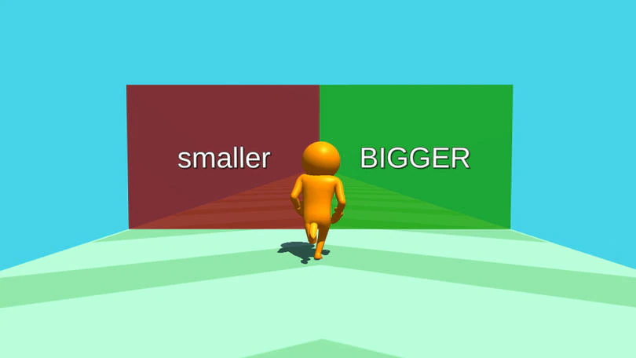
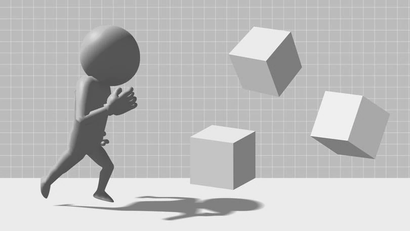
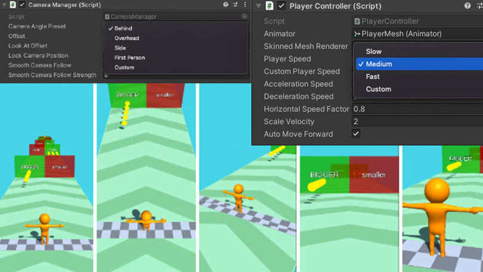
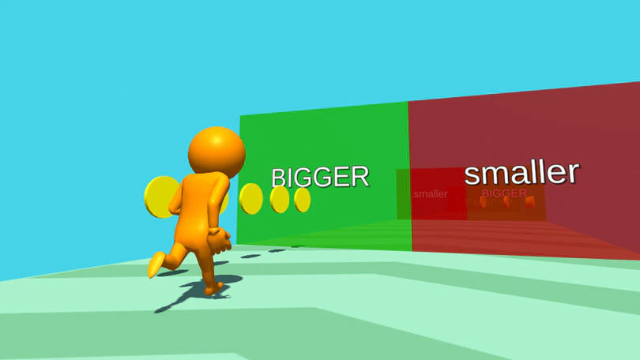
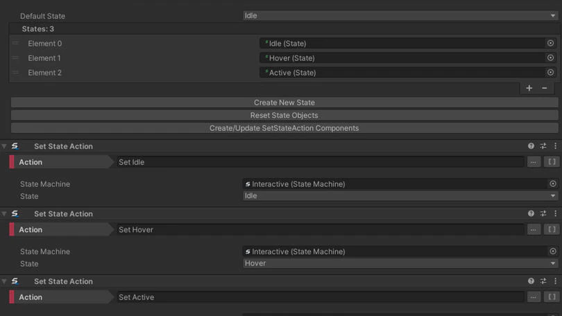
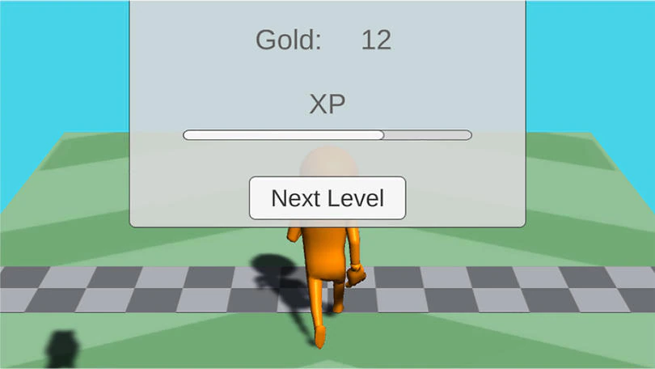
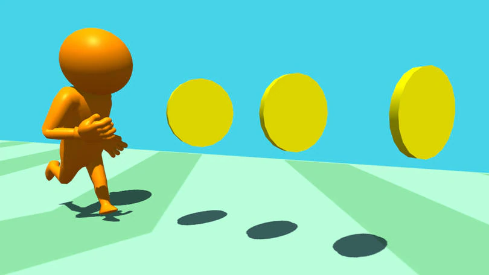
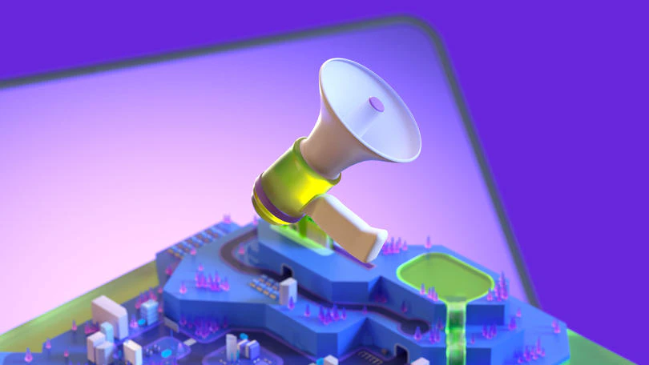

# Unity Runner Template

Speed up your development process with this Runner template’s prebuilt game mechanics and features.

### In-Editor tutorial

After downloading the free template in the Hub, you’ll get an in-Editor tutorial. This will walk you through the template’s components, how to create and modify levels with the template’s built-in level editor, and how to set up an Ads service for your project.

### Greybox design

To help save time, the template provides fully functional end-to-end game mechanics and greyboxed assets as a starting point.

From there, you can add your own themes, differentiated textures, and assets – either through the Unity Asset Store or by working with an artist. For example, you can focus on runway geometry and add gameplay elements like obstacles, gates, and items such as coins and keys.

### Level editor

The template contains customizable levels that showcase different game designs. Customization features include:

* Auto-save: Changes to Level, Player prefab, or Camera prefab are automatically saved when entering Play mode.
* Terrain: Specify length, width, start buffer, end buffer, thickness, and material of the terrain, which automatically regenerates if any of these fields are edited.
* Snapping: Enable snapping for spawnable objects, which will snap them to the nearest grid position.
    Prefabs: Specify a prefab to be placed at the start and end of the level.

### Camera and player presets

The difference between a game being a hit or not can be very small: Camera angle, colors, and speed all play a big role. The Runner template comes with options so you can experiment and find what works best for your game.

**Camera angle presets:**

Easily select between commonly used camera positions. You can also lock camera position, enable a smooth camera follow, and more.

**Player speed presets:**

Choose from slow, medium, fast, or custom presets. Other options include auto move forward, acceleration speed, horizontal speed, scale velocity, and more.

### Spawnables

For objects placed in a scene, the Spawnable class provides all logic for serializing and deserializing transform information and color, as well as snapping to a level’s grid. Spawnable objects include:

* Coins
* Keys
* Gates that influence player scale or speed

### Game framework

Classes that form the framework of the game include:

* An Event system that facilitates the communication between different parts of the game
* A State machine that manages the flow of the game, loading and unloading levels, and navigation through states like win, lose, pause, etc.
* A simple inventory system that keeps track of currencies like gold and XP 
* A Save system that saves the game progress
* A UI System that displays designated UIs for the current state of the game

### UI window system

This template features a full UI flow for a runner game. 

For example, when players complete a level successfully, they will see a celebration screen. This screen contains rewards based on their performance, as well as gold and XP earned. XP is displayed in the form of a progress bar that indicates how far the player is from reaching the next milestone.

The included level selection screen enables players to replay the levels they have unlocked. Pressing the Quick Play button loads the highest unlocked level.

### Currencies

There are two types of currencies in the game: Gold and XP

* Players can pick up gold throughout a level. If a player does not complete a level successfully, the amount of gold collected during that level won’'t be added to their total amount.
* XP is earned when players move through a level and works as a mileage currency. The amount of XP earned during a level is added to the total amount of XP whether the player wins or loses.

### Unity Ads package

Unity Ads integration is built in to help you create a monetizable game. If you’re looking to build a revenue-generating mobile game, the runner template is a great place to start, and a good way to learn how to use the Unity Ads SDK.
